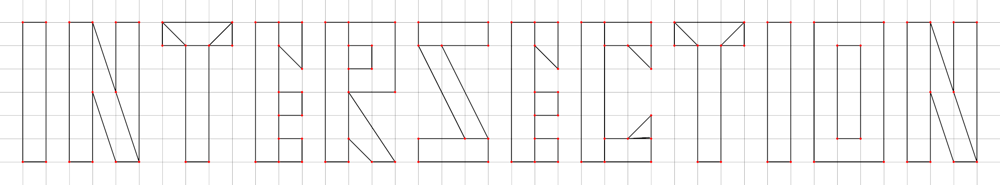

<div style="text-align: center">

# **Intersection of convex polygons**


</div>

## Description
**The Intersections of Convex Polygons** project allows users to solve a mathematical problem concerning finding the common area of intersection of two or more convex polygons on a plane using the resulting *.exe* file format  without having to worry about the intricacies of the implementation.

Our team provide users with a grid on a plane that allows them to construct exclusively convex shapes and see the intersection of these shapes, as well as their area.

The project has important practical applications in computer graphics, design and other areas where geometric data processing is required.

## Quick Start
Just copy the repository folder to your local machine. If you are a developer and are interested in code, then it is better to study the section called *[ Project structure](https://github.com/conk7/C-AutoCAD-trial-ver?tab=readme-ov-file#project-structure)*. If you are a user, then simply go to the *../release* folder, in which the file you need will be stored - *CMakeSFMLProject.exe*.

## Possibility of use
As mentioned previously, the project enables users to visually represent convex shapes entered on a grid, identify their intersections, and calculate the area of the overlapping regions. An important feature of the project is the ability to **snap vertices to the grid**, meaning that the coordinates of the figure's vertices can only be integer values located at the grid lines' intersections.

The project offers the following features:
- Ability to **move along** the grid while **holding down the LKM** key.
- Ability to **zoom** using **mouse wheel**.
- The functionality to **remove all shapes** from the grid by pressing the **delete** key.
- The functionality to **move a specific vertex** when you **hover the mouse** over this vertex and **hold down the left control** key.
- The functionality to **delete a specific vertex** when you **hover the mouse** over this vertex and **hold down the V** key.
- The functionality to **cancel the last constructed polygon** using the key combination **left control** + **Z**.

## Project structure
The project structure looks like this:
```python
C-AUTOCAD-TRIAL-VER/
│
├── include/
│   ├── algorithm.hpp
│   ├── grid.hpp
│   ├── line.hpp
│   ...
├── misc/
│   ├── Dosis-VariableFont_wght.ttf
│   ├── intersection.png
│   ...
├── release/
│   ├── CMakeSFMLProject.exe
├── src/
│   ├── algorithm.cpp
│   ├── grid.cpp
│   ├── line.cpp
│   ...
├── .gitignore
├── CMakeLists.txt
├── README.md
```
The *include* folder contains header files in hpp format for including project files.

The *misc* folder stores auxiliary project files, such as fonts, images for the README, etc.

The *release* folder stores the final file in .exe format, which is the result of the project.

The *src* folder contains cpp files with project implementation code.

*.gitignore* is necessary to ensure that locally collected files are not uploaded to the shared repository.

*CMakeLists.txt* is required to build the project on the local machine using CMake utilities. As a result, a *../build* folder will be created with the standard project build files.

*README.md* is needed to describe the project on the repository page.
## Authors and Feedback
The project was made by:
- [Vladislav Tyurin](https://github.com/conk7)
- [Pavel Lekomtsev](https://github.com/PavelLekomtsev)
- [Maxim Zakharov](https://github.com/maximvw)
- [Alexey Kalinkin](https://github.com/cactuarix)
- [Timofey Pyankov](https://github.com/TomBomBon)
- [Rodion Kholodov](https://github.com/londxz)
  
  For feedback on the project, you should write to our product manager: *Rodion Kholodov* - https://t.me/londxz